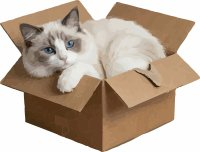

# catpaq

## GUI for ZPAQ archives powered by zpaqfranz. Browse versions, extract files, test integrity and ADD new content — no installation required

### Compared to most other GUIs for ZPAQ archives, it is possible to CREATE archives, not just extract their contents, in a way conceptually similar to interfaces like 7-Zip, WinRAR, and so on.

 _The name of this project is a tribute to my beloved cat Sharon Stone, nicknamed Frufru. I miss her so much. :sob:_

ZPAQ is one of the best compression formats around — great compression ratio, incremental backups, full version history. 
The catch: it has no official GUI. 
**catpaq** fixes that. 
Drop it next to `zpaqfranz`, open an archive, and you're done.

---

## Features

-  **Browse any ZPAQ archive** — see all files and folders, with full version history
-  **Time machine** — navigate between archive snapshots and extract any past version of a file
-  **Integrity test** — verify your archive with real-time progress and ETA, results shown directly in the log
-  **Add files** — select files and folders from the built-in file explorer and add them to any archive
-  **Extract** — extract single files, folders, or everything, with GUI destination picker
-  **Encrypted archives** — supports zpaq's AES and zpaqfranz's Franzen password protection
-  **Filter & search** — quickly find files inside large archives
-  **Hash calculation** — CRC32, SHA256, BLAKE3, XXH3 and many more, with clipboard copy on single file
-  **Portable** — no installer, no registry, no admin rights needed (unless you want file associations)
-  **Cross-platform** — runs on Windows, Linux and macOS (_work in progress_)

---

## Requirements

Catpaq is a front-end: it needs the `zpaqfranz` executable to do the actual work, and will offer to download it for you (on Windows).
BTW `zpaqfranz` [official repository](https://github.com/fcorbelli/zpaqfranz)

---

## Installation

No installer required.

1. Download the latest release from the [Releases page](../../releases)
2. Unzip the archive to any folder you like
3. Place `zpaqfranz` (`zpaqfranz.exe` and `zpaqfranz.dll` on Windows) in the same folder
4. Run `catpaq.exe` (Windows) or `catpaq` (Linux/macOS)

**Technical detail.**  
Each version of `catpaq` keeps the SHA-256 hashes of both `zpaqfranz.exe` and `zpaqfranz.dll` hardcoded internally. This is done to limit the possibility of code “injection”. Therefore, attention must be paid to keeping `catpaq.exe`, `zpaqfranz.exe`, and `zpaqfranz.dll` aligned (in the directory from which they are executed).

It is possible that, in the future, I will change this policy, i.e., I may generate a single `.EXE` for Windows. However, I must also consider portability to different systems (Mac, Linux), on which I have not yet performed enough experiments.

These are the first releases; the work will improve over time.

(Windows) To open `.zpaq` files directly from your file manager, run catpaq as Administrator and use **Settings → Associate .zpaq and .zpaq.franzen**.

---

## Screenshots

| Archive browser | Integrity test | File explorer |
|---|---|---|
|  |  |  |

---

## How it works

Catpaq is a GUI layer over `zpaqfranz`. 
Every action — listing, extracting, testing, adding — translates into a `zpaqfranz` command that runs in the background. 
Output is streamed live into the Log tab, so you always see exactly what's happening.

The **Add tab** is a built-in file explorer: navigate your drives, select files, and send them to any archive in a few clicks. 
No drag-and-drop from an external window needed.

The use of two different modes (DLL and EXE) is designed to maximize the performance of archive listing. For simplicity reasons, the DLL incorporates a lot of superfluous code, but it is much easier to keep aligned with the EXE.  

In the new releases of `zpaqfranz`, you can notice the management using the `DL` define. Essentially, it is a matter of using direct operating system callbacks instead of Lazarus’s own mechanisms.

---

## Building from source

Catpaq is written in **Free Pascal / Lazarus**. To build it yourself:

1. Install [Lazarus](https://www.lazarus-ide.org/) (tested with 4.x)
2. Clone this repository
3. Open `catpaq.lpr` in the Lazarus IDE
4. Build → Compile

Almost no external dependency 

---

## Credits

Catpaq is a front-end for [zpaqfranz](https://github.com/fcorbelli/zpaqfranz) by Franco Corbelli, which is itself based on [ZPAQ](http://mattmahoney.net/dc/zpaq.html) by Matt Mahoney. 

All the heavy lifting — compression, encryption, verification — is done by zpaqfranz.

---

## License

MIT — see [LICENSE](LICENSE) for details.
